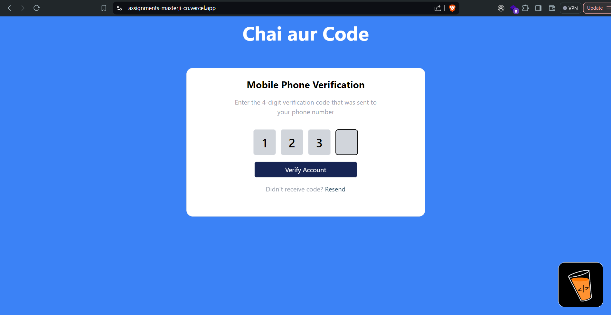
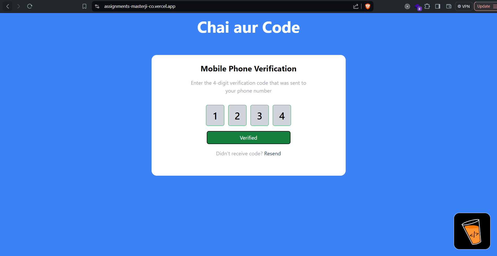
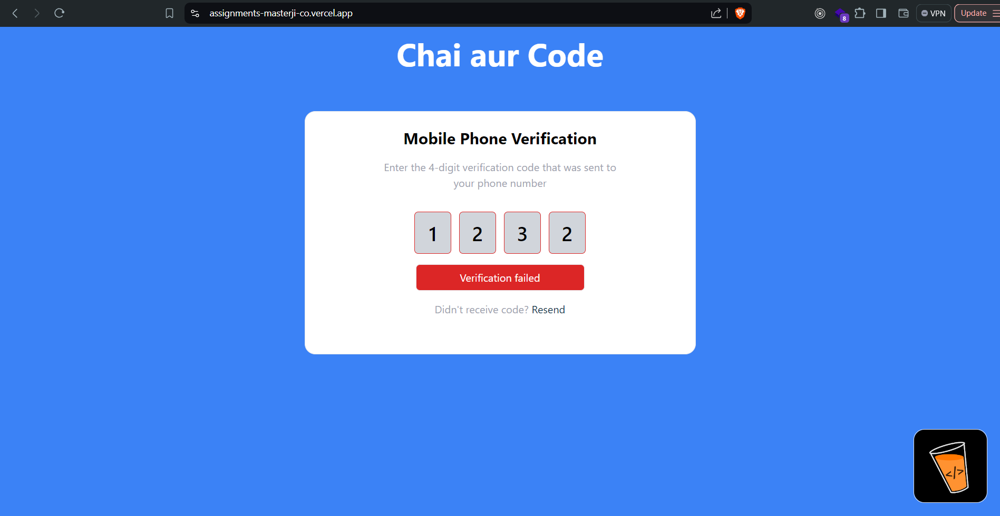
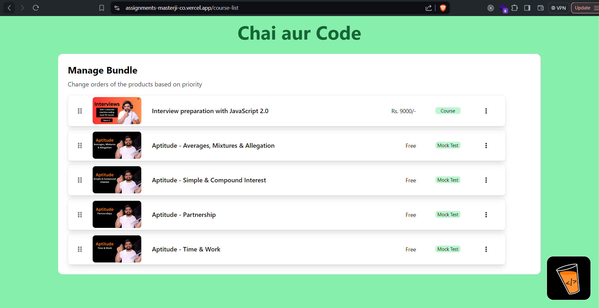
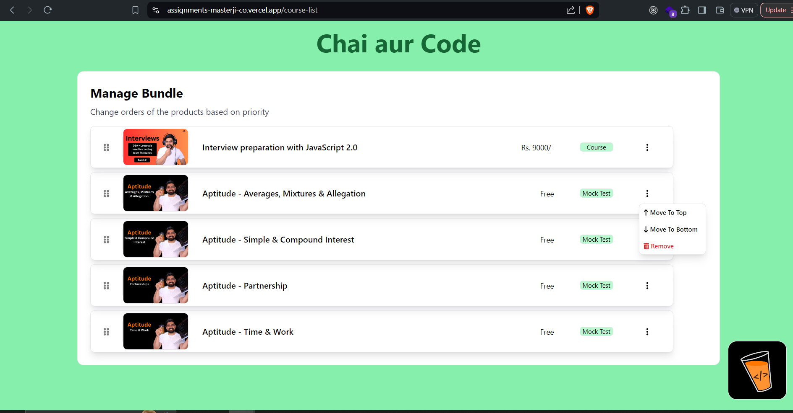
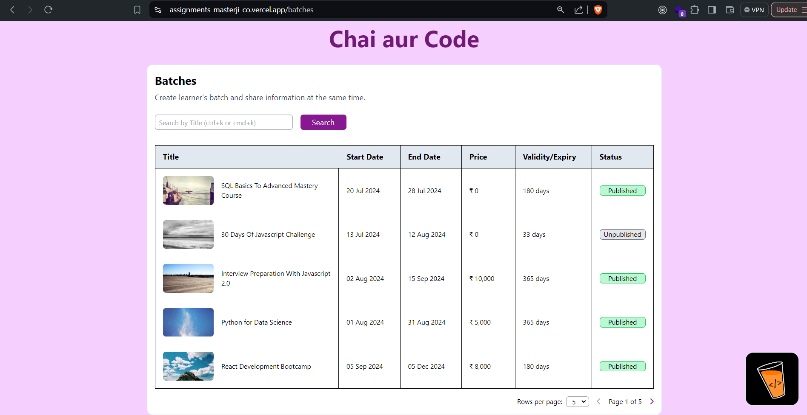
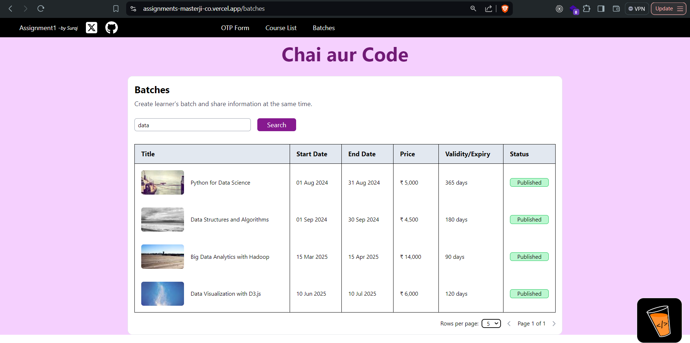

# Assignment 1

#### Hosted here --> [assignment-1-live-link](https://assignments-masterji-co.vercel.app/)

## Overview

Welcome to the MasterJi assignment. This project involves implementing three components based on provided Figma designs using React. The components are accessible through different routes, and there is a specific requirement for branding and functionality.

## Tasks

1. **OTP Form**
   - **Empty Form State**: A form to input a 4-digit OTP.
  
      
   - **Filling State**: The state during the input of the OTP.
   
      
   - **Filled State (Success)**: The state when the OTP is correctly filled.
     
     
   - **Filled State (Error)**: The state when the OTP is incorrectly filled.
    
2. **Drag and Drop Course Cards**
   - Implement a list of vertical course cards using a drag-and-drop library of your choice.
   
        
   - Each card should have actions for:
     - "Move to Top"
     - "Move to Bottom"
     - "Remove"

      

3. **Data Table**
   - Create a paginated table listing batches of a course and their statuses.
    
   - Include a search option to filter the batches.

      

## Routes

- **/otp-form**: Route for the OTP Form component.
- **/course-list**: Route for the Drag and Drop Course Cards component.
- **/batches**: Route for the Data Table component.

The base URL (`/`) will redirect to the OTP Form route (`/otp-form`).


## Installation

To set up and run the project locally, follow these steps:

1. **Clone the repository:**
   ```bash
   git clone https://github.com/suraj2860/assignments-masterji.co.git
2. **Install node_modules**
   ```bash
   cd Assignment1-22072024
   npm install
3. **Run Project**
   ```bash
   npm run dev